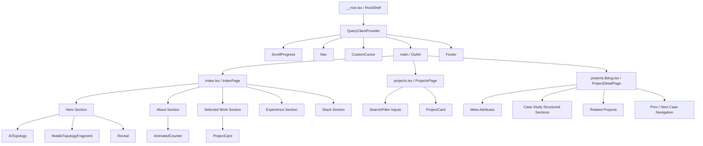

# Repository Analysis: P S Suryanarayanan Portfolio

This report outlines the structural, stylistic, and architectural layout of the portfolio codebase. It reviews the design system, components, responsive adaptations, and technical details, identifying strengths, potential technical debt, and opportunities for optimizations.

---

## 1. Architecture Overview

The portfolio is structured as a modern Single Page Application (SPA) with Server-Side Rendering (SSR) capabilities built on **TanStack Start** (React 19, Vite, TanStack Router, and Nitro).

### Folder Structure
```
Surya's Portfolio/
├── e2e/                             # Playwright regression tests
│   └── experience-visual.spec.ts    # Visual snapshot testing for responsive layouts
├── public/                          # Static public assets (favicon.svg, robots.txt)
├── src/
│   ├── assets/                      # Local images and corresponding Lovable asset JSONs
│   ├── components/
│   │   ├── site/                    # Custom portfolio widgets (Nav, Footer, AITopology, etc.)
│   │   └── ui/                      # shadcn/ui shared primitives (accordion, dialog, dropdown, etc.)
│   ├── hooks/                       # Custom React hooks (use-mobile.tsx)
│   ├── lib/                         # Constants, site metadata, databases, and core utilities
│   │   ├── error-capture.ts         # Server-side uncaught exception tracing
│   │   ├── error-page.ts            # SSR fallback page generator
│   │   ├── error-reporting.ts       # Client runtime reporting boundary
│   │   ├── projects.ts              # Work database and sorting/navigation helpers
│   │   ├── site.ts                  # General contact details and navigation items
│   │   ├── skills.ts                # Skill database and internship mappings
│   │   ├── smooth-scroll.ts         # Scroll spy & custom ease-out interpolation
│   │   └── utils.ts                 # Classname merge utility
│   ├── routes/                      # Page routes mapped by TanStack Router file-system conventions
│   │   ├── __root.tsx               # Root shell, providers, scroll progress, custom cursor, navigation
│   │   ├── index.tsx                # Main single-page portfolio layout
│   │   ├── projects.$slug.tsx       # Detail case study template
│   │   ├── projects.tsx             # Interactive project catalog with filtering and search
│   │   └── sitemap[.]xml.ts         # Server-side dynamic XML sitemap endpoint
│   ├── routeTree.gen.ts             # Auto-generated route tree definitions
│   ├── router.tsx                   # React Router & Query client instantiations
│   ├── server.ts                    # SSR wrapper entry point
│   ├── start.ts                     # TanStack Start initializer middleware
│   └── styles.css                   # Tailwind v4 globals, custom animations, custom cursor variables
├── package.json                     # Dependency manifests & script configs
├── vite.config.ts                   # Vite bundler options
└── tsconfig.json                    # TypeScript compiler options
```

### Routing & Navigation
Routing is powered by `@tanstack/react-router` which generates static-types for all routes:
- `/` - Main landing page showcasing Hero, AITopology, About, Featured Projects, Experience, and Stack/Skills.
- `/projects` - Complete catalog page with client-side category filters and live text queries.
- `/projects/$slug` - Deep engineering case studies presenting objectives, workflows, challenges, code implementation details, decision matrices, tradeoffs, and outcomes.
- `/sitemap.xml` - Dynamic server-side SEO route generating XML definitions.

---

## 2. Design System Summary

The visual styling follows an engineering-centric, high-contrast, dark-mode-only aesthetic reminiscent of Apple, Nothing OS, and Linear interfaces.

### Color Palette (OKLCH Tokens)
The theme configuration utilizes `oklch` syntax in `src/styles.css` for precision gradients and contrast preservation:
- **Background**: `oklch(0 0 0)` (Pure Black)
- **Foreground**: `oklch(1 0 0)` (Pure White)
- **Card Fill**: `oklch(0.145 0 0)` (Dark Charcoal)
- **Muted text**: `oklch(0.78 0 0)` (Readable Medium Gray)
- **Subtle text/elements**: `oklch(0.66 0 0)` (Dim Gray)
- **Borders**: `oklch(0.24 0 0)` (Subtle outlines separating containers)

### Typography Hierarchy
Custom typography utilizes five Google Font families:
1. **Display** (`Space Grotesk`): Wide, clean geometric headings with custom letter-spacing (`tracking-[-0.03em]`).
2. **Sans** (`Inter`): High legibility default text with optimized font features (`ss01`, `cv11`).
3. **Mono** (`IBM Plex Mono`): Technical code snippets, parameters, and metadata values.
4. **Dot** (`Silkscreen`): Vintage uppercase badges and indicator highlights (e.g., `// INDEX · PROJECTS`).
5. **JP** (`Noto Sans JP`): Clean Japanese translations inside Logo structures.

### Spacing & Borders
- **Spacing**: Rigid spacing increments (`py-24 md:py-32`) establishing balanced negative space.
- **Border Radius**: Structured radii based on variables: `--radius: 1.25rem` (20px) for container cards and `9999px` for pill badges/buttons.
- **Grids**: Overlayed grid lines pattern (`grid-lines`) masked with radial gradients to define sections.

### Motion Principles & Hover Interactions
- **Custom Cursor**: A floating 12px SVG ring and 2px dot utilizing `requestAnimationFrame` coordinate easing. It swells over interactive items, displays clicks through ripple scaling, and hides when entering inputs/code fields.
- **Scroll Spy & Anchors**: Anchor elements smoothly scroll with custom cubic-bezier math (`duration = Math.min(800, Math.max(600, Math.abs(distance) * 0.6))`) and flash sections upon arrival via an animation scale keyframe.
- **AITopology Animation**: SVG network utilizing coordinate sine oscillations to emulate living, floating knowledge.
- **Reveal**: Intersections triggers custom scroll-up and fade animations (`transform: translateY(14px) → 0px`, `opacity: 0 → 1` over 700ms).

---

## 3. Component Hierarchy



---

## 4. Strengths

1. **Custom Interactive Graph (`AITopology`)**: Built entirely in vanilla React and SVG without heavy force-directed graph libraries (like D3 or Three.js). Highly efficient, responsive mapping, and includes nice micro-interactions.
2. **Performant Easing Animations**: The custom scroll mechanics, page reveal transitions, custom cursor math, and numeric tick counters are written in low-overhead, GPU-accelerated configurations.
3. **Structured Case Studies**: The data structure inside `src/lib/projects.ts` contains dense, authentic project records (objectives, decisions, tradeoffs, challenges, outcomes) rather than generic text.
4. **Tailwind CSS v4 & OKLCH Custom Variables**: The project leverages modern CSS features (OKLCH, modern CSS color-mix, native container page utilities) inside Tailwind v4.
5. **Stellar Visual Regression Coverage**: The project includes Playwright tests that capture E2E layouts and verify cross-viewport consistency, protecting against visual regressions.

---

## 5. Potential Improvements

### Low Risk
* **Standardize `prefers-reduced-motion` Helpers**: Currently, the helper function `prefersReducedMotion` is duplicated across both `AITopology.tsx` and `smooth-scroll.ts`. Consolidating this into a shared helper in `src/lib/utils.ts` would improve maintenance.
* **Typing consistency in Navigation Callback**: In `src/components/site/Nav.tsx`, the `navigate` function has `void navigate(...)` which is fine but could be handled with standard React Router typings instead.
* **AITopology Scale Precision**: The viewport mapping clientside Clientspace client coordinates (`clientX`, `clientY`) to viewBox coordinates (100x120) could benefit from standard responsive size detection to make the pointer hover zone perfectly accurate across all screen sizes.

### Medium Risk
* **Search Input Optimization**: In `src/routes/projects.tsx`, the search query filters projects on every keystroke. Although the project count is small (~4 items), as the count grows, a simple debounced search mechanism would avoid unnecessary re-renders.
* **Contact Form Fallback**: The contact links in the header and footer (`mailto:suryanarayananps2005@gmail.com`) could be supported by an on-site, serverless or clientside simple email form to improve conversion.
* **Missing Resume File**: The navigation and footer link points to `/resume.pdf`, which does not exist in the public folder. Users will encounter a 404 error if they attempt to download the resume.

### High Risk
* **Router/Query client context caching**: In `src/router.tsx`, `QueryClient` is initialized inside the `getRouter` factory function. In some SSR build paths, instantiating a fresh client inside router wrappers can lead to state mismatch or duplicate fetch streams on hydrate if query results are not fully hydrated. Keeping the initialization outside or caching it solves hydration issues.

---

## 6. Technical Debt

* **Local JSON Metadata**: The project uses static arrays (`projects` and `experience`) defined in TypeScript files (`src/lib/projects.ts` and `src/lib/skills.ts`). This is great for performance, but adds code weight. If content grows significantly, it could be separated into clean static JSON files or markdown files parsed at build-time.
* **CSS Override Overrides**: Tailwind CSS v4 handles variants differently. The `@custom-variant dark (&:is(.dark *));` is defined but the app utilizes a hardcoded dark layout standard, making some dark variant declarations redundant.

---

## 7. Performance Review

* **Asset Lazy Loading**: Images (such as `portrait` in `index.tsx`) use `loading="lazy"`. However, since the portrait image is located near the top of the page (in the About section, which is immediately visible on smaller desktop/tablet viewports), this might trigger a minor LCP (Largest Contentful Paint) delay. Removing `lazy` loading for elements above the fold would optimize initial render speed.
* **SVG Complexity**: The `AITopology` component contains 70 nodes and 58 edges. Rendering these dynamically via React state ticking updates coordinates on every frame, which can cause minor layout tasks. Since elements only float by ~0.5 units, this floating could be offloaded to pure CSS translations using custom properties, leaving React to only handle mouse hovers.

---

## 8. Accessibility Review (a11y)

* **Contrast Ratio**: The design is dark-mode-only and uses white text (`oklch(1 0 0)`) on a black background (`oklch(0 0 0)`), which provides excellent contrast. However, elements using `--color-subtle` (`oklch(0.66 0 0)`) on a black background have a contrast ratio of roughly 4.2:1. WCAG AA standards require 4.5:1 for normal text, meaning small subheadings/captions could be slightly adjusted for readability.
* **Custom Cursor Focus/Tab Traversal**: The custom cursor overrides pointer icons on hover. However, users traversing the website via a keyboard do not trigger cursor mouse movement events, meaning interactive custom styles do not apply. Screen reader indicators for keyboard focus state should be verified.
* **Icon labels**: Icons like `Github` and `Linkedin` inside buttons/links should contain explicit `aria-label` text when they do not accompany plain text (e.g., in the header) to support assistive technologies.

---

## 9. Final Understanding

The portfolio of P S Suryanarayanan is an engineering-first, minimal showcase of machine learning, computer vision, and full stack systems. 

The site's philosophy is strictly reflected in the code:
- **Typography First**: Heavy use of custom fonts, uppercase tracking, and custom spacing.
- **Negative Space**: Minimal layout lines, keeping elements apart.
- **Motion with Purpose**: Scrollspy highlights, topological node paths, and scroll reveals add detail without feeling overwhelming.
- **Engineering Over Marketing**: Focus on case study architecture diagrams, decisions, and tradeoffs, rather than flashy animations.
